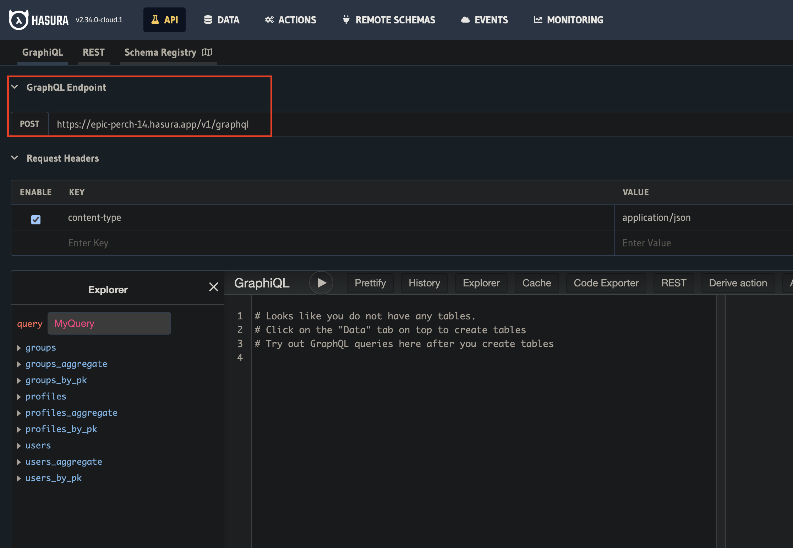

# react / typescript で chrome extension を開発するテンプレート

## 概要

typescript コンパイラ(tsc)で、typescript コードを javascript コードに変換する。

変換した javascript コードを chrome extension が認識できる形に変換するのを webpack で行う。

(import/export されているモジュールを１つの JS ファイルにまとめる。)

## 構築手順メモ

1. typescript のインストール
   1. tsconfig.json ファイルの作成
2. react のインストール
3. webpack と webpack-cli のインストール
   1. webpack.config.js ファイルの作成と設定追加
      1. typescript と react をバンドルできるように設定
         1. 作業内容は[こちらのコミット](https://github.com/g-ishi/chrome-extension-boillerplate/commit/1e7ea347417c6333db4300b7848e5ce00c4b2271)を参照
      2. manifest.json や static ファイルがバンドルに含まれるように設定
         1. 作業内容は[こちらのコミット](https://github.com/g-ishi/chrome-extension-boillerplate/commit/2b2fb6f65c8cb3e1af1bd570a91ee58ac9a03c4b)を参照
      3. css をバンドルできるように設定
         1. 作業内容は[こちらのコミット](https://github.com/g-ishi/chrome-extension-boillerplate/commit/b79e385627167f4a5be731ef9a3425b913d698c1)を参照
      4. background と contentScript をバンドルする設定を追加
         1. 作業内容は[こちらのコミット](https://github.com/g-ishi/chrome-extension-boillerplate/commit/b1a09dc1c9b6f9ee5d93c94d57d81a467ef559bb)を参照
      5. typescript の型補完が有効になるように設定
         1. 作業内容は[こちらのコミット](https://github.com/g-ishi/chrome-extension-boillerplate/commit/4fd061ea66d71ba04b29952f9bf0319f4f4449c7)を参照
4. 本番用の Webpack 設定ファイルと、開発用の Webpack 設定ファイルを分離する

   - `webpack-merge`ライブラリを使って`webpack.prod.js`と`webpack.dev.js`ファイルを用意し、`webpack.common.js`を継承し、必要な設定値のみを上書きするようにする
   - 作業内容は[こちらのコミット](https://github.com/g-ishi/chrome-extension-boillerplate/commit/3df7104ad6beb830f75b2f2ec9bd9209d8976388)を参照

5. GraphQL の設定(Hasura との接続)

6. 必要なライブラリ群をインストール

```sh
npm i --save-dev @apollo/client graphql @apollo/react-hooks cross-fetch @graphql-codegen/cli @graphql-codegen/typescript
```

2. codegen の設定ファイルの初期化

```sh
npx graphql-codegen init

    Welcome to GraphQL Code Generator!
    Answer few questions and we will setup everything for you.

? What type of application are you building? Application built with React
? Where is your schema?: (path or url) https://epic-perch-14.hasura.app/v1/graphql
? Where are your operations and fragments?: src/queries/**/*.ts
? Where to write the output: src/gql/
? Do you want to generate an introspection file? No
? How to name the config file? codegen.ts
? What script in package.json should run the codegen? codegen
Fetching latest versions of selected plugins...

    Config file generated at codegen.ts

      $ npm install

    To install the plugins.

      $ npm run codegen

    To run GraphQL Code Generator.
```

schema の URL は Hasura の管理画面のここ。



`Where are your operations and fragments?`は query ファイルの置き場所を指定する。

3. query の定義

送りたいリクエストを Hasura の GraphQL コンソールから作成して、それを query としてコピーして query として定義する。

query 定義後、以下のコマンドで gql 関連のファイルが指定した output フォルダに自動生成される。

```sh
npm run codegen
```

### memo

- ライブラリを全て devdependencies でインストールしている理由

  - 最終的に１つの js ファイルにするだけだから、全部の node モジュールが devdependency の扱いになる。
  - dev-dependency にしても、コードから import されてるものは build アセットに含まれるから大丈夫。

### 使い方

TBD

使い方書いて記事化したい。
